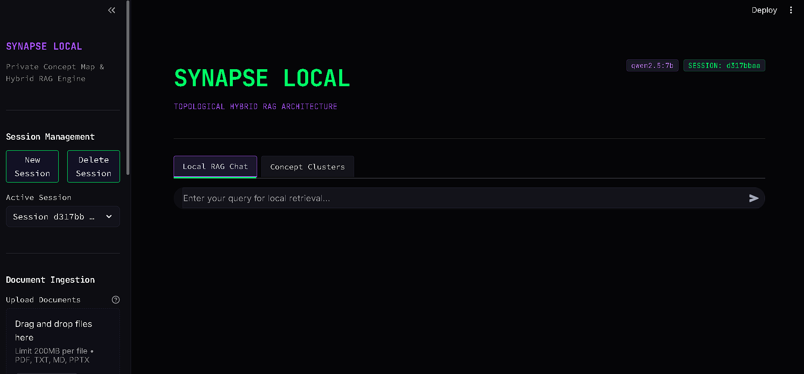
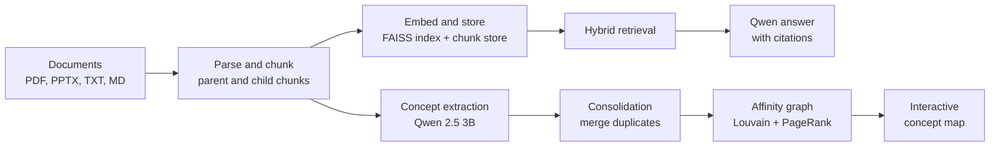
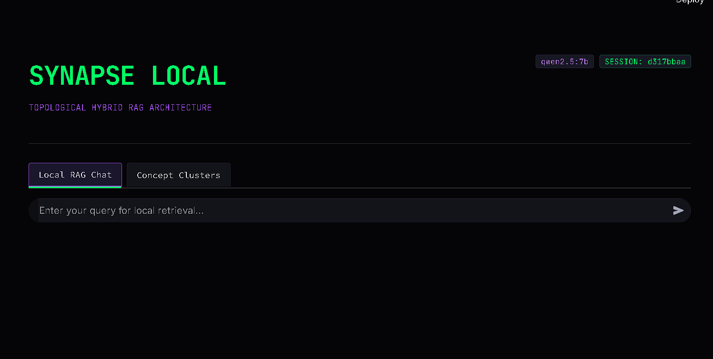
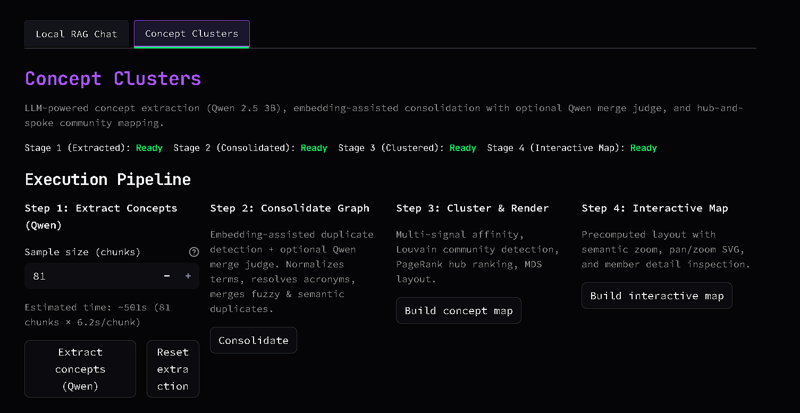
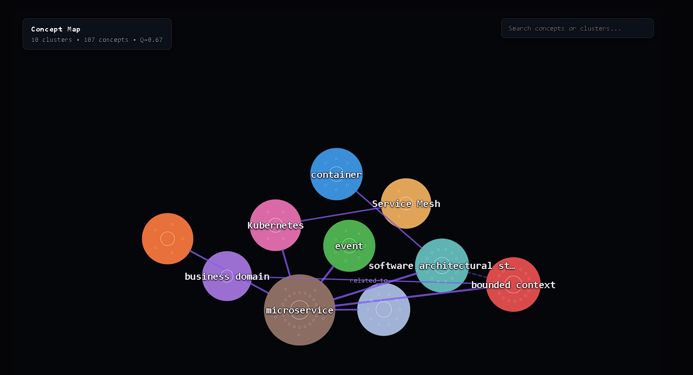
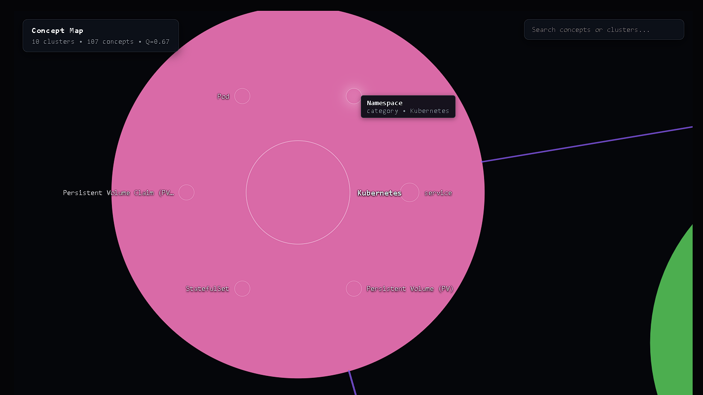
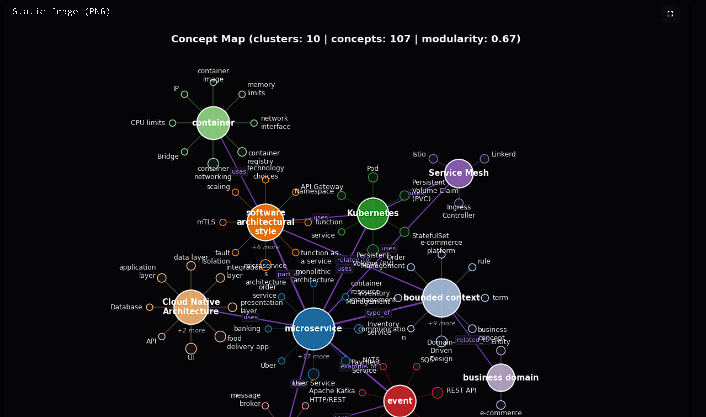
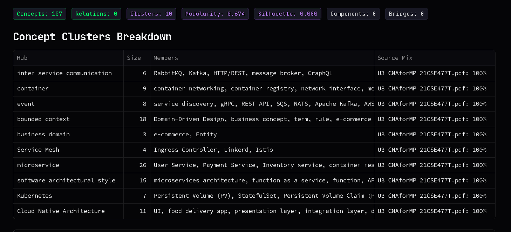

# SynapseLocal

**A private, local-first document intelligence system that combines hybrid retrieval-augmented generation with an LLM-derived concept map.**

SynapseLocal ingests your own documents (PDF, PPTX, TXT, Markdown), builds a searchable knowledge base, answers questions with cited sources using a locally hosted Qwen model, and extracts a structured map of the concepts those documents contain. Everything runs on your machine through Ollama and local libraries. No document, embedding, or query leaves the device.



*The SynapseLocal interface: session controls and staged services on the left, chat and concept map views on the right.*

---

## Table of Contents

1. [Overview](#1-overview)
2. [Key Features](#2-key-features)
3. [System Architecture](#3-system-architecture)
4. [Concepts Behind the System](#4-concepts-behind-the-system)
5. [User Interface Guide](#5-user-interface-guide)
6. [Getting Started](#6-getting-started)
7. [Project Structure](#7-project-structure)
8. [Configuration](#8-configuration)
9. [Limitations](#9-limitations)
10. [Possible Extensions](#10-possible-extensions)
11. [Troubleshooting](#11-troubleshooting)

---

## 1. Overview

Most retrieval-augmented generation projects treat the embedding model as a black box: split text into fixed-size pieces, embed them with a default model, and hope retrieval works. SynapseLocal treats the data-science stages (representation, ranking, structure discovery) as the primary engineering problem and uses the language model where it adds the most value.

The system has two cooperating pipelines built on one shared, canonical set of document chunks:

- **Retrieval pipeline.** Documents are parsed, chunked, embedded, and indexed in FAISS. At question time, a hybrid retriever finds relevant passages and a local Qwen model answers with citations.
- **Concept map pipeline.** A small local model (Qwen 2.5 3B) reads the chunks and extracts concepts and typed relations. Classical algorithms then consolidate duplicates, build a weighted affinity graph, detect communities, rank hub concepts, and render the result as an interactive, zoomable map.

The two pipelines are deliberately decoupled. The concept map is a representation and exploration layer; it does not slow down or alter question answering.

---

## 2. Key Features

| Area | Capability |
|---|---|
| Privacy | Fully local inference through Ollama, local FAISS index, no external services |
| Ingestion | PDF, PPTX, TXT, and Markdown, with multiple documents per session |
| Sessions | Isolated workspaces; each session owns its documents, indexes, and derived artifacts and can be deleted completely |
| Retrieval | Dense vector search with FAISS, hybrid ranking, grounded answers with citations |
| Concept extraction | Schema-constrained JSON output from Qwen 2.5 3B, closed relation vocabulary, grounding validation, resumable checkpoints |
| Consolidation | Lexical, acronym, and embedding-assisted duplicate merging with an optional LLM judge for borderline cases |
| Clustering | Multi-signal affinity graph, Louvain community detection, PageRank hub ranking, bridge-concept detection |
| Visualization | Interactive semantic-zoom concept map (self-contained HTML), plus a static PNG export |
| Resource discipline | Staged services executed one at a time, sequential model calls, models unloaded after use |

---

## 3. System Architecture



### Staged services

Each stage is an independent service with a single entry point. A stage reads only the files produced by the previous stage, writes its own outputs to disk, releases its memory, and returns. Stages never call each other, and only one runs at a time per session.

| Stage | Where | Model used | Output |
|---|---|---|---|
| Embed and Store | Sidebar | Embedding model | Chunk store, embeddings, FAISS index |
| 1. Extract concepts | Concept Clusters tab | Qwen 2.5 3B | `concepts_raw.jsonl`, `extract_log.json` |
| 2. Consolidate | Concept Clusters tab | Embedding model, optional Qwen judge | `concept_graph.json`, `concept_vectors.npy` |
| 3. Cluster and render | Concept Clusters tab | None | `concept_clusters.json`, `concept_map.png` |
| 4. Interactive map | Concept Clusters tab | None | `concept_map.html` |

Artifacts are stored per session on disk, so a rebuild of one stage never requires recomputing an earlier one, and each stage caches results using a hash of its inputs.

---

## 4. Concepts Behind the System

This section explains the reasoning and algorithms behind each component, and where the language model and the data-science methods each contribute.

### 4.1 Design principles

1. **Representation quality determines answer quality.** If chunks are coherent and ranking is rigorous, the language model becomes a reasoning layer over clean context instead of a guesser.
2. **Use the LLM for language understanding, and algorithms for structure.** The model reads text and proposes concepts and relations. Deterministic algorithms validate, merge, cluster, and lay out the result.
3. **Constrain and verify every model output.** A small model is useful only when its output space is restricted and its claims are checked against the source text.
4. **Separate representation from generation.** Retrieval and the concept map share chunks but not runtime, so each can be improved independently.
5. **Respect local hardware.** Sequential execution, small context windows, and explicit model unloading keep memory pressure low.

### 4.2 Ingestion and representation

**Parsing.** Text is extracted from PDF (PyPDF2) and PPTX (python-pptx). For slide decks, titles and table contents are preserved so that context is not lost. Chunks carry metadata such as source document and heading, which later appear in citations.

**Parent-child chunking.** Documents are divided into larger parent units (a paragraph or slide section) and smaller child units. Child chunks are embedded and searched for precision, because short text yields sharper similarity scores. When a child matches, its parent provides the surrounding context for generation. This avoids the usual trade-off: small chunks retrieve precisely but lack context; large chunks keep context but produce diluted embeddings.

**Embeddings and vector search.** Chunks are embedded with a local embedding model (`nomic-embed-text` through Ollama, or `all-MiniLM-L6-v2` through sentence-transformers). Vectors are L2-normalized so that inner product equals cosine similarity, and are stored in a FAISS index. At this scale an exact (flat) index is preferred over approximate indexes because it gives exact results at negligible cost.

### 4.3 Hybrid retrieval and grounded generation

Dense retrieval captures meaning ("fault tolerance" matches "high availability") but can blur exact identifiers such as acronyms, port numbers, or version strings. Sparse retrieval (BM25) captures exact terminology. SynapseLocal combines both so that neither blind spot decides the result.

Ranked lists are merged with Reciprocal Rank Fusion, which needs no score normalization:

$$
\mathrm{RRF}(d) = \sum_{m \in M} \frac{1}{k + r_m(d)}
$$

where $r_m(d)$ is the rank of document $d$ under retrieval method $m$ and $k$ is a smoothing constant. The top candidates are optionally re-scored by a cross-encoder, which reads the query and passage together and is more precise than a bi-encoder, before only the best few are passed to the Qwen model. The prompt instructs the model to answer from the supplied context, and every answer is returned with citations identifying the document, chunk, heading, retrieval source, and score.

### 4.4 Concept extraction with a small local LLM

The concept map starts with Qwen 2.5 3B reading parent chunks one at a time. Small models are unreliable when asked open-ended questions, so the extraction stage is built around constraints and verification.

**Constrained decoding.** Ollama structured outputs restrict generation to a JSON schema, so every response parses. Each chunk yields:

- `concepts`: noun phrases of one to four words, each tagged with a `kind` (`category`, `component`, `practice`, `attribute`, `example`).
- `main_topic`: the single concept the chunk is mainly about.
- `relations`: typed links between listed concepts.

**Closed relation vocabulary.** Relations are limited to `type_of`, `part_of`, `example_of`, `uses`, and `related_to`. For the three hierarchical relations the source is always the narrower concept, which gives the graph a consistent direction for hubs and spokes.

**Grounding validation.** A model can invent plausible terms. Every extracted concept must be supported by the chunk text (token overlap check, or an acronym and expansion pair that appears in the text), and every relation must connect two retained concepts. Generic words and prompt-example leakage are filtered. The log records how many items were dropped, which serves as a first quality signal.

**Evidence.** For each relation, the sentence in the chunk with the highest overlap with both endpoints is stored as evidence. This costs no model tokens and lets the interface show why a link exists.

**Operational properties.** Calls are deterministic (temperature 0, fixed seed), strictly sequential, use a small context window, and checkpoint after every chunk so an interrupted run resumes where it stopped. A stable prompt prefix allows the runtime to reuse its key-value cache across chunks. The model is unloaded at the end of the stage.

### 4.5 Consolidation

Raw extraction produces duplicates such as "microservice" and "microservices architecture". Consolidation merges them in layers, from cheapest to most expensive:

1. **Normalization.** Lowercasing, punctuation and article removal, light singularization.
2. **Acronym aliasing.** Patterns such as `Infrastructure as a Service (IaaS)` found in the source text link the acronym to its expansion.
3. **Lexical merging.** Fuzzy string similarity, plus rules that merge a term with its generic-suffix form when the shorter concept already exists. A suffix rule never creates a concept, which prevents damage to terms such as "operating system".
4. **Embedding-assisted merging.** Concept names are embedded and compared. Pairs above a high cosine threshold that also pass a lexical gate are merged automatically. The gate prevents merging related but distinct neighbors such as "scalability" and "elasticity".
5. **LLM judge for the borderline band.** Pairs in an uncertain similarity range are sent to Qwen with a schema-constrained yes/no question and the supporting sentences. This follows a simple principle: embeddings provide recall, the language model provides precision, and the model is used only where it is needed.

Further consolidation steps: hierarchy edges are checked for contradictions and cycles; concepts present in more than half of all chunks are flagged as document-wide topics (they would otherwise connect everything and obscure community structure); and every merge decision is recorded in a report visible in the interface.

### 4.6 Affinity graph and community detection

Relations from a small model are precise but sparse, and a graph built from them alone fragments into disconnected islands. SynapseLocal therefore fuses three complementary signals into one affinity per concept pair:

| Signal | Definition | Strength |
|---|---|---|
| Relations (R) | Relation weight by type, scaled by supporting evidence | Precise, sparse |
| Co-occurrence (C) | Cosine of binary chunk-incidence vectors, $\lvert P_i \cap P_j \rvert / \sqrt{\lvert P_i \rvert \lvert P_j \rvert}$ | Dense, document-grounded |
| Semantic similarity (S) | Cosine similarity of concept vectors (name plus supporting sentence) | Bridges vocabulary gaps between documents |

$$
A_{ij} = w_R\,R_{ij} + w_C\,C_{ij} + w_S\,S_{ij}
$$

The default weights favor relations, then co-occurrence, then semantic similarity. The graph is then sparsified: weak edges are dropped and only each concept's strongest neighbors are kept, while hierarchical relation edges are always preserved.

**Community detection.** Louvain modularity optimization runs at several resolution values, and the partition with the best modularity whose median community size is sensible is selected. Very small communities are merged into their closest neighbor.

### 4.7 Hubs, membership, and bridge concepts

- **Importance** is PageRank on the affinity graph.
- **Hub selection** within each community combines PageRank, the number of hierarchical children, how often the concept is the main topic of a chunk, and its support. Only concepts whose `kind` is suitable for a hub (`category`, `component`, `practice`) are eligible, which keeps attributes and examples from becoming cluster titles.
- **Soft membership** measures how strongly a concept belongs to its own cluster relative to all clusters.
- **Bridge concepts** have substantial affinity to another cluster. They mark where topics interact, and where knowledge from different documents combines.

### 4.8 Layout and interactive rendering

**Cluster placement.** Cluster centers come from classical multidimensional scaling on cluster-to-cluster affinity, so distance carries meaning: closely related topics sit near one another, weakly related topics are far apart. A relaxation step then guarantees spacing between clusters.

**Inside a cluster.** Members are arranged on concentric rings ordered by importance, so large clusters stay legible.

**Links.** Between clusters, a maximum spanning tree plus above-median links is drawn, which removes crossing clutter while keeping the global structure.

**Semantic zoom.** The map is a self-contained HTML file with inline SVG and no external resources. Whether a cluster shows detail is decided by its own on-screen size, so large clusters expand sooner than small ones, and labels are chosen greedily by priority to avoid collisions. The layout is precomputed in Python, so the browser performs no physics simulation and panning remains smooth.

### 4.9 Quality metrics

The interface reports metrics that describe the result rather than relying on visual impression:

| Metric | What it measures | How to read it |
|---|---|---|
| Modularity | Strength of community structure in the affinity graph | Higher is better; values roughly above 0.3 indicate meaningful structure |
| Silhouette (cosine) | How well concept vectors separate by cluster | Higher is better; near zero means overlapping clusters |
| Components | Number of disconnected pieces in the affinity graph | Fewer is better; many components indicate sparse extraction |
| Hub coverage | Share of cluster members linked directly to the hub by a hierarchical relation | Higher means cleaner hub-and-spoke structure |
| Cross-source concepts | Concepts supported by two or more source files | Shows where documents overlap |

### 4.10 Resource discipline

- One stage at a time per session, enforced with a lock file.
- No parallel model calls; Ollama requests are sequential with a small context window.
- Models are unloaded when a stage finishes, and the embedding model is released before any language-model call in the same stage.
- Heavy libraries are imported lazily so the application starts quickly.
- Stage results are cached by input hash.

---

## 5. User Interface Guide

The interface is a Streamlit application with a dark theme. The sidebar controls sessions, ingestion, and models; the main area has two tabs.

### 5.1 Sidebar

- **Session Management.** Create a new session, switch between sessions, or delete the active one. Each session is an isolated workspace.
- **Document Ingestion.** Upload PDF, TXT, Markdown, or PPTX files. Files are staged and then processed when the Embed and Store service runs.
- **Local Inference Model.** Choose the Qwen model used for answering (7B, 14B, 32B, or the coder variant) and the embedding model.
- **Services Pipeline.** The Embed and Store button parses, chunks, embeds, and indexes the staged documents. The label changes to Re-embed and Store once an index exists.
- **System Status.** Shows whether storage and the concept map have been built for the active session.

### 5.2 Local RAG Chat


*Chat view with an expanded citation panel.*

Ask questions about the documents in the active session. Each answer includes an expandable **Source Citations** panel listing, for every supporting passage, the document, chunk identifier, heading, retrieval source, and relevance score. The panel makes it possible to verify any statement against its origin.

### 5.3 Concept Clusters

The Concept Clusters tab turns the document set into a navigable map of ideas. It is organized as a four-step pipeline, an interactive map, and a set of diagnostics.

#### Pipeline controls


*The status row and the four pipeline steps.*

A status row shows which stages are ready. Each step has its own button and is enabled only when its input exists.

| Step | Control | Purpose |
|---|---|---|
| 1. Extract Concepts (Qwen) | Sample size, extract, reset | Reads parent chunks with Qwen 2.5 3B. The sample size allows a quick trial on the first N chunks. A progress bar and time estimate are shown, and an interrupted run resumes from its checkpoint. |
| 2. Consolidate | Single button | Merges duplicates using normalization, acronyms, embeddings, and the optional Qwen judge. |
| 3. Build Concept Map | Single button | Builds the affinity graph, detects communities, ranks hubs, and renders a static image. |
| 4. Build Interactive Map | Single button | Generates the self-contained interactive map. |

If the documents do not contain enough structure (too few concepts or relations), the tab reports this and suggests extracting more chunks or adding richer source material instead of drawing a misleading plot.

#### The interactive map


*Overview: clusters appear as colored bubbles with hub titles. Distance reflects relatedness.*

The map reveals detail progressively as you zoom, and each cluster decides its own level of detail from its on-screen size.

| Zoom level | What is visible |
|---|---|
| Overview | Collapsed cluster bubbles with hub titles and the strongest links between clusters |
| Expanded | Hub circle, member concepts, labels for the most important members, and bridge connections |
| Detail | All member labels that fit, relation labels on links, and full hover information |


*Expanded cluster: members arranged around the hub, sized by importance.*

**Visual encoding**



- Color identifies the cluster.
- Member size reflects importance (PageRank).
- Member opacity reflects how strongly the concept belongs to its cluster.
- A gold outline marks concepts that appear in two or more source documents.
- Solid hub-to-member lines indicate a direct hierarchical relation; dotted lines indicate an indirect association.
- Dashed lines connect bridge concepts to the other cluster they relate to.

**Interaction**

- Scroll to zoom toward the cursor, drag to pan, pinch on touch devices, double-click to zoom in.
- Click a hub to fly to its cluster; click a member to select it, highlight its neighborhood, and open the detail panel.
- Use the search box to jump to any concept; use the minimap to orient and recenter; use the reset control to return to the full view.
- The detail panel shows a concept's kind, cluster, source files, importance, membership strength, supporting sentence, and related concepts with evidence. For a hub it shows cluster size, keywords, source mix, and links to other clusters.


*Detail panel for a selected concept, with evidence sentences drawn from the source text.*

The map can be downloaded as a standalone HTML file and opened full screen in any browser. It performs no network requests. A static PNG version is also kept in a collapsible section.

#### Metrics and tables


*Metric badges, cluster breakdown, and bridge concepts.*

- **Metric badges:** concepts, relations, clusters, modularity, silhouette, components, and bridges (see [Quality metrics](#49-quality-metrics)).
- **Concept Clusters Breakdown:** one row per cluster with its hub, size, members, and the share contributed by each source document.
- **Bridge Concepts:** concepts that connect two clusters, with the origin and target cluster and a ratio indicating bridge strength.

#### Diagnostics

Collapsible sections expose how the map was produced:

- **Merge Report:** every duplicate decision with the two terms, their cosine similarity, and the outcome.
- **Top Relations (with evidence):** the best-supported relations with the sentence that supports each one.
- **Global Topics, Orphans and Extraction Log:** document-wide topics excluded from clustering, concepts that could not be placed in a cluster, and extraction statistics such as grounding yield.

#### Example

For a set of cloud computing notes and slides, a typical result is a hub called "infrastructure" surrounded by service-model members, linked at a distance to a "hardware" hub surrounded by accelerator members. Concepts mentioned in both the slides and the notes carry a gold outline, showing where the two sources overlap.

---

## 6. Getting Started

### Prerequisites

- Python 3.10 or later
- [Ollama](https://ollama.com) installed and running
- Enough memory for the models you select; the 3B extraction model is lightweight, while larger chat models require correspondingly more

### Installation

```bash
git clone https://github.com/indrayudh19/SynapseLocal.git
cd SynapseLocal

python -m venv .venv
source .venv/bin/activate        # Windows: .venv\Scripts\activate
pip install -r requirements.txt
```

### Pull the models

```bash
ollama pull qwen2.5:7b          # answering (selectable in the sidebar)
ollama pull qwen2.5:3b          # concept extraction and merge judge
ollama pull nomic-embed-text    # default embedding model
```

### Run

```bash
streamlit run app.py
```

### Typical workflow

1. Create a session in the sidebar.
2. Upload one or more documents.
3. Run **Embed and Store**.
4. Ask questions in **Local RAG Chat**.
5. Open **Concept Clusters** and run the four steps in order. Start with a small sample size to check the result quickly, then extract the full document set.

---

## 7. Project Structure

```
SynapseLocal/
├── app.py                        # Streamlit interface (sidebar, chat, concept clusters)
├── requirements.txt
├── .streamlit/                   # Streamlit configuration
├── backend/
│   ├── session_manager.py        # Session creation, listing, upload storage, deletion
│   ├── pipeline.py               # Hybrid retrieval and answer generation
│   ├── vector_store.py           # Local FAISS-backed vector store
│   └── local_llm.py              # Ollama client and embedding helpers
├── representation/
│   ├── paths.py                  # Per-session artifact paths
│   ├── embed_store.py            # Embed and Store service
│   ├── concept_schema.py         # Shared constants and extraction schema
│   ├── extract_concepts.py       # Stage 1: Qwen concept extraction
│   ├── build_concept_graph.py    # Stage 2: consolidation
│   ├── cluster.py                # Stage 3: affinity graph and clustering
│   ├── concept_plot.py           # Static PNG renderer
│   ├── map_layout.py             # Stage 4: layout and interactive HTML export
│   └── map_template.html         # Self-contained interactive map template
└── data/                         # Per-session documents and generated artifacts
```

Generated artifacts for each session include the chunk store and FAISS index, `concepts_raw.jsonl`, `extract_log.json`, `concept_graph.json`, `concept_vectors.npy`, `concept_clusters.json`, `concept_map.png`, and `concept_map.html`.

---

## 8. Configuration

| Setting | Location | Notes |
|---|---|---|
| Answering model | Sidebar | Qwen 2.5 7B, 14B, 32B, or Qwen 2.5 Coder 7B |
| Embedding model | Sidebar | `nomic-embed-text` (Ollama) or `all-MiniLM-L6-v2` (sentence-transformers) |
| Extraction model and thresholds | `representation/concept_schema.py` | Extraction model name, merge thresholds, affinity weights, resolution candidates, size limits |
| Streamlit theme and server options | `.streamlit/` | Standard Streamlit configuration |

Changing the embedding model requires re-running Embed and Store so that the index and the query vectors share the same space.

---

## 9. Limitations

- **Extraction quality is bounded by the small model.** A 3B model can mislabel concept kinds or miss relations. Grounding checks, constrained output, and consolidation reduce but do not remove this.
- **Sparse documents yield sparse maps.** Very short or purely narrative documents may not contain enough relational structure for a meaningful map; the interface reports this.
- **The concept map and retrieval are independent.** Answers are produced by the retrieval pipeline; the map is an analysis and exploration tool and does not currently feed the answering step.
- **Interactive map behavior in Streamlit.** The map is an embedded, one-way component: clicks inside it do not call back into Python, and a Streamlit rerun resets the view. The downloadable HTML avoids both constraints.
- **Scale.** The map is rendered as SVG and is intended for up to roughly one to two thousand drawn concepts; per-cluster member limits keep it within that range.
- **Single-user, local operation.** The application is designed for one user on one machine.

---

## 10. Possible Extensions

- Graph-augmented retrieval: use the concept graph to expand queries across related concepts and documents.
- Sub-cluster splitting for very large clusters.
- An evaluation harness for retrieval quality (hit rate and mean reciprocal rank on a labeled question set), with and without graph expansion.
- Persistent graph storage behind a small storage interface, so alternative backends can be swapped in.

---

## 11. Troubleshooting

| Symptom | Likely cause | Resolution |
|---|---|---|
| "Error communicating with Ollama" | Ollama is not running | Start Ollama and retry |
| Model not found | Model has not been pulled | Run the corresponding `ollama pull` command |
| Concept map reports insufficient structure | Too few concepts or relations extracted | Increase the sample size, extract all chunks, or use richer documents |
| Many disconnected clusters or duplicate hubs | Sparse relations or missed merges | Review the Merge Report and extraction log; extract more chunks |
| Interactive map resets its view | Streamlit reran the page | Avoid changing other widgets while exploring, or open the downloaded HTML |
| Retrieval quality drops after switching embedding model | Index and queries use different embedding spaces | Re-run Embed and Store |
